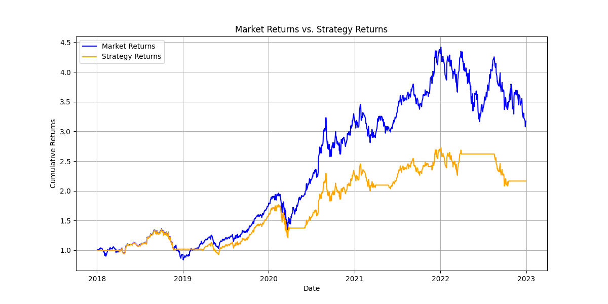
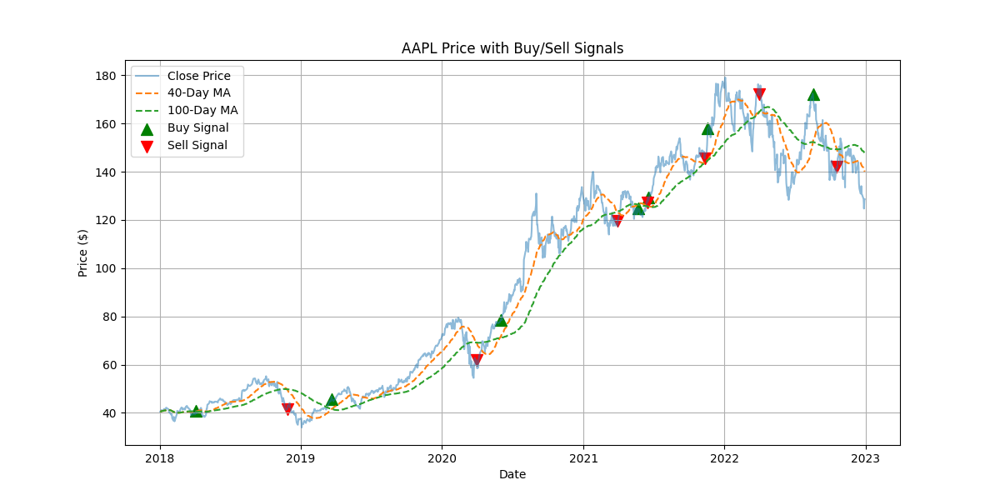

# Simple Trading Strategy: Moving Average Crossover

This project implements and backtests a **Moving Average Crossover Trading Strategy** using Apple.Inc historical stock data from Yahoo Finance. The strategy compares the performance of buying and selling based on short-term and long-term moving average crossovers against a simple buy-and-hold approach.

## Overview

The Moving Average Crossover strategy generates:
- **Buy signals** when a short-term moving average crosses above a long-term moving average.
- **Sell signals** when the short-term moving average crosses below the long-term moving average.

The aim is to determine if this technical strategy can outperform a traditional buy-and-hold investment approach.

---

## Results

### Cumulative Returns Comparison
The graph below shows the performance of the **strategy returns** (orange line) compared to the **market returns** (blue line). While the market consistently outperformed the strategy over the observed period, the strategy reduced risk during market corrections, as evident in the flatter sections of the orange line.



### Buy/Sell Signals
The chart below shows the stock's price (Apple, in this case) along with the short-term and long-term moving averages. The **green markers** represent buy signals, and the **red markers** represent sell signals. These signals were generated by the crossover of the moving averages.



---

## Key Observations

1. **Market Outperformance:**  
   The buy-and-hold strategy (market returns) outperformed the moving average crossover strategy over the period.

2. **Risk Mitigation:**  
   The crossover strategy exited the market during major drawdowns (e.g., early 2020), reducing exposure to volatility.

3. **Lagging Signals:**  
   The moving average crossover strategy suffered from lagging signals, causing it to miss some recovery periods.

---

## Features

- **Stock Data Retrieval:** Download historical stock data using `yfinance`.
- **Moving Average Calculation:** Compute short-term and long-term moving averages.
- **Signal Generation:** Identify buy and sell signals based on moving average crossovers.
- **Backtesting:** Evaluate the strategy's performance using cumulative returns and compare it to the market.
- **Visualization:** Create visual representations of trading signals and cumulative returns.

---

## Technologies Used

- **Python**: For scripting and analysis.
- **Libraries**:
  - `yfinance`: Fetch historical stock data.
  - `pandas`: Data manipulation and calculations.
  - `matplotlib`: Data visualization.

---

## Installation

1. **Clone the Repository**
   ```bash
   git clone https://github.com/BelineIsingizwe/Simple-Trading-Strategy.git
   cd Simple-Trading-Strategy
